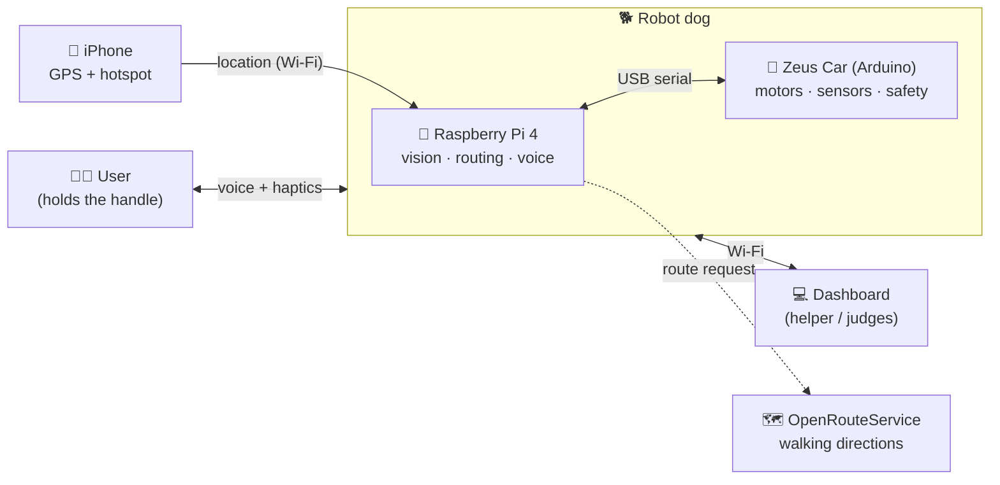
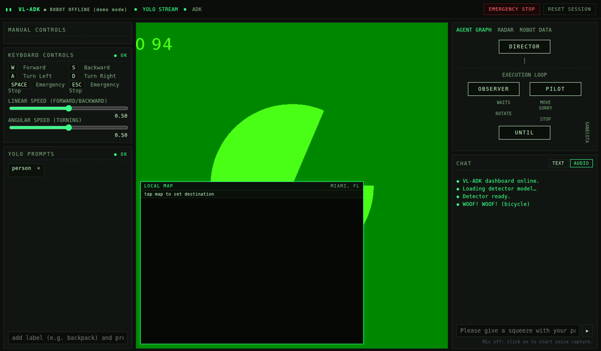
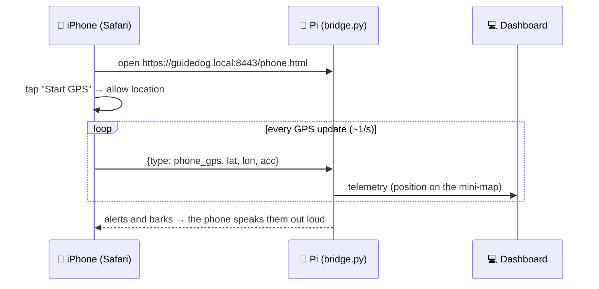
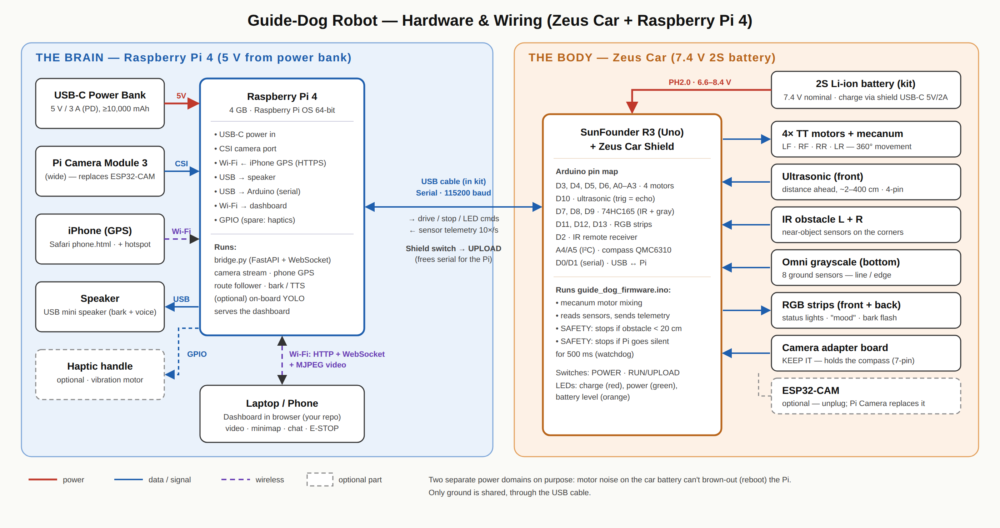
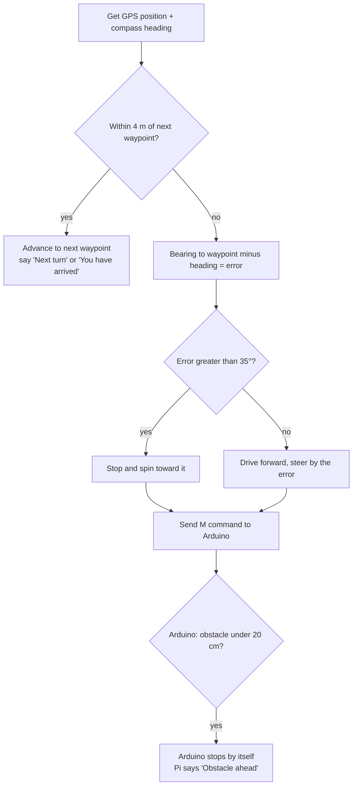
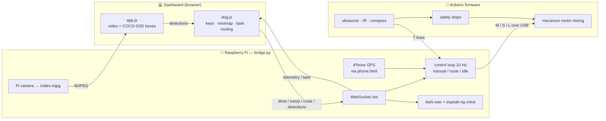

# 🐕‍🦺 Guide-Dog Robot — Project Guide

**ShellHacks 2026 · SunFounder Zeus Car + Raspberry Pi 4**

> An autonomous robot "guide dog" for people who are blind or have low vision. It walks a route using GPS, watches the path with a camera, warns about obstacles out loud, and (for fun) **barks** at things it doesn't like. A web dashboard lets a sighted helper or a judge see what the dog sees, where it is on a live mini-map, and hit an emergency stop.

This guide assumes you know nothing about the project. If you read it top to bottom you'll understand what every part does, how to build it, and how to run it.

---

## Table of contents

1. [The idea in 60 seconds](#1-the-idea-in-60-seconds)
2. [What's in this folder](#2-whats-in-this-folder)
3. [The dashboard you already have](#3-the-dashboard-you-already-have)
4. [The Zeus Car kit, explained](#4-the-zeus-car-kit-explained)
5. [Adding a Raspberry Pi 4: the plan](#5-adding-a-raspberry-pi-4-the-plan)
6. [Hardware and wiring diagram](#6-hardware-and-wiring-diagram)
7. [Shopping list (bill of materials)](#7-shopping-list-bill-of-materials)
8. [Build it step by step](#8-build-it-step-by-step)
9. [How the software fits together](#9-how-the-software-fits-together)
10. [The fun features](#10-the-fun-features)
11. [Safety and honest limits](#11-safety-and-honest-limits)
12. [Troubleshooting](#12-troubleshooting)
13. [Glossary](#13-glossary)
14. [Links](#14-links)

---

## 1. The idea in 60 seconds

A real guide dog does three jobs: it **leads** you to where you're going, it **avoids** things in the way, and it **tells** you (by stopping or pulling) when something is wrong. The robot copies those jobs:

| Guide-dog job | How the robot does it |
|---|---|
| Lead the way | **iPhone GPS** + the car's compass follow a walking route, one waypoint at a time |
| Avoid obstacles | Ultrasonic + IR sensors stop the car on their own. The camera spots people, bikes, cars |
| Communicate | Speaks out loud ("Obstacle ahead", "Next turn", "You have arrived"). The LEDs change color. It **barks** at things on its dislike list |
| Be supervised | A web dashboard shows the live camera, detections, a mini-map with the route, and an **E-STOP** button |



**The key design decision:** the robot has **two brains**.

* The **Raspberry Pi** is the smart brain. It handles the camera, GPS, routing, sound, and the dashboard.
* The **Arduino** on the Zeus Car is the reflex brain. It only drives motors and reads sensors, and it **will stop the car by itself** if something is too close or if the Pi freezes. That's how you keep a "smart" robot safe.

---

## 2. What's in this folder

```
guide-dog/
├── PROJECT_GUIDE.md                 ← you are here
├── docs/
│   ├── hardware-diagram.svg / .png  ← wiring diagram (section 6)
│   └── dashboard-demo.png           ← screenshot of the upgraded dashboard
├── dashboard/                       ← your ShellHacks dashboard, upgraded
│   ├── index.html                   (small edits: robot camera , map HUD, Q/E keys)
│   ├── app.js                       (small edits: robot camera + detection hook)
│   ├── styles.css                   (new styles appended at the bottom)
│   ├── dog.js                       ← NEW: driving, minimap upgrades, barking, routing
│   ├── phone.html                   ← NEW: open on the iPhone to share its GPS
│   └── sounds/bark.mp3, bark.wav    ← placeholder bark (swap in a better one!)
├── pi/
│   ├── bridge.py                    ← NEW: runs on the Pi, the "brain" server
│   ├── requirements.txt
│   ├── make_certs.sh                ← NEW: HTTPS certificate so the iPhone can share location
│   └── bark.wav
└── firmware/
    └── guide_dog_firmware/
        └── guide_dog_firmware.ino   ← NEW: runs on the Zeus Car's Arduino
```

---

## 3. The dashboard you already have

Your repo (`shellhacks2026-main`) is a static web page with three columns and a green "hacker terminal" look.

| Area | What it does **today** | Status |
|---|---|---|
| **Video + detection** (center) | Opens the **laptop's webcam** and runs **COCO-SSD** object detection in the browser (TensorFlow.js). It draws green boxes and filters by the "YOLO prompt" chips | ✅ Real (it's COCO-SSD, not YOLO, but it works) |
| **Mini-map** (bottom-left of video) | Leaflet + OpenStreetMap, dark-themed, centered on Miami, jumps to your browser location once | ✅ Real, but static |
| **Keyboard controls** | Shows W/A/S/D + sliders | ⚠️ **Display only**: no key handling, nothing is sent anywhere |
| **E-STOP / Reset** | Writes a chat message | ⚠️ Doesn't stop anything |
| **Chat** | Echoes "Acknowledged: …" | ⚠️ Placeholder |
| **Agent graph** (Director → Observer/Pilot) | Static boxes | ⚠️ Visual only |
| **README.md** | Empty | — |

**What the upgrade in `dashboard/` adds** (with the original look kept):

* When the page is served **by the robot**, video comes from the robot's camera (`/video.mjpg`) and detection runs on that feed.
* **W/A/S/D + Q/E** actually drive the car. Q/E slide sideways, because mecanum wheels can do that. **Space/Esc** and the E-STOP button really stop it.
* The mini-map gets live GPS from the iPhone, a **heading arrow**, a **breadcrumb trail**, **tap-to-route**, a distance HUD, ⚠️ **hazard pins**, and **click-to-expand**.
* **Barking:** a sound, the video shakes, and "WOOF!" pops up on screen.
* A "● ROBOT ONLINE / OFFLINE" badge in the top bar.
* **Demo mode:** open it from a laptop with no robot and the webcam, barking, and minimap all still work. Good for pitching.



---

## 4. The Zeus Car kit, explained

The **SunFounder Zeus Car** is an Arduino robot car with **mecanum wheels**. Those wheels have little angled rollers, so the car can drive forward, sideways, diagonally, and spin in place (360° movement).

### 4.1 What's in the box (from the kit sheet)

| Part | What it is / does |
|---|---|
| **R3 board** | Arduino Uno-compatible microcontroller, the car's "reflex brain" |
| **Zeus Car Shield** | Plugs on top of the R3. It holds the motor drivers, sensor ports, power switch, and battery charger |
| **4× TT gear motors + 4 mecanum wheels** | Drive. Labeled Left-Front, Right-Front, Right-Rear, Left-Rear |
| **Ultrasonic module** (front) | Measures distance ahead with sound pings (~2 cm to a few meters) |
| **2× IR obstacle-avoidance modules** | Short-range "is something right here?" sensors on the left and right |
| **Omni grayscale module** (bottom) | 8 downward sensors for line-following and edge detection |
| **2× RGB LED strips** | Front and back lights |
| **ESP32-CAM + camera adapter board** | Wi-Fi camera used by SunFounder's phone app. **The adapter board also holds the compass (QMC6310)** |
| **Battery** | 2-cell Li-ion pack (7.4 V nominal). It charges through the shield's USB-C port |
| **IR remote**, cables (3/4/6/7-pin), USB-B and USB-C cables, standoffs, screws, plates A–D | Assembly bits |

Assembly is 33 illustrated steps on the kit sheet (motors → ultrasonic → camera mount → R3 + shield → wiring → battery → RGB → grayscale → wheels). **Watch the wheel direction in step 33.** The rollers must form an "X" pattern when viewed from above, or sideways driving won't work.

### 4.2 Shield pinout (which Arduino pin does what)

| Arduino pin | Connected to |
|---|---|
| D3, D4 | Motor 1 (A/B) |
| D5, D6 | Motor 2 (A/B) |
| A3, A2 | Motor 3 (A/B) |
| A1, A0 | Motor 4 (A/B) |
| D7, D8, D9 | 74HC165 shift register, which reads the **IR obstacle + grayscale** sensors |
| D10 | Ultrasonic (trigger and echo share one pin) |
| D11, D12, D13 | RGB LED strips |
| D2 | IR remote receiver |
| A4/A5 (I²C) | Compass QMC6310 (on the camera adapter board) |
| D0/D1 (serial) | ESP32-CAM **or** USB, selected by the small **RUN/UPLOAD switch** |

**Power:** the battery input accepts 6.6–8.4 V. Charging is via the shield's USB-C port (5 V/2 A, about 130 minutes). The LEDs show charging (red), power (green), and battery level (orange).

> **Takeaway:** almost every Arduino pin is already used. That's fine. The Pi will own all the new hardware (camera, GPS, speaker), and the Arduino only needs its USB serial port to talk to the Pi.

---

## 5. Adding a Raspberry Pi 4: the plan

### 5.1 Why add a Pi at all?

The Arduino Uno has **2 KB of RAM**. It can't do vision, GPS routing, text-to-speech, or host a dashboard. The ESP32-CAM can stream video, but it can't run a real object detector well. A **Pi 4** is a full Linux computer: Python, a camera, audio, and Wi-Fi.

### 5.2 How the Pi connects (the simple, robust way)

| Question | Answer | Why |
|---|---|---|
| How does the Pi talk to the Arduino? | **USB cable** (the USB-B cable from the kit) → the Arduino's USB port | No soldering and no 5 V↔3.3 V level shifting. The same cable is used to upload code from the Pi |
| What about the ESP32-CAM? | **Unplug it** from the adapter. Set the shield switch to **UPLOAD** | The ESP32 and USB share the Arduino's single serial port. With the switch on UPLOAD, the port belongs to USB/the Pi |
| Keep the camera adapter board? | **Yes!** | It carries the **compass**, which route-following needs for heading |
| Which camera? | **Pi Camera Module 3 (Wide)** on the CSI ribbon | Better image and a wider view than the ESP32-CAM, and the Pi reads it directly |
| How is the Pi powered? | Its **own USB-C power bank** (5 V/3 A) | The Pi 4 needs about 3 A. The car battery's voltage sags when motors start, and that would reboot the Pi. Separate batteries = no brown-outs |
| GPS? | **An iPhone** running `phone.html` in Safari | Nothing to buy, and the phone's GPS is usually better than a cheap USB dongle. The phone sends its location to the Pi over Wi-Fi. The iPhone can also be the **Personal Hotspot** that the Pi and laptop join (section 5.4) |
| Heading (which way the robot faces)? | The **car's compass** (on the camera adapter board) | The phone's direction depends on how it's held. The robot's own compass always points where the robot points |
| Sound? | **USB mini speaker** | For barking and spoken warnings. The Pi 4's 3.5 mm jack also works with a small powered speaker |

### 5.3 Mounting

* Stack the Pi **above the shield** on an acrylic or 3D-printed deck with M2.5 standoffs, or on the D-plate area with velcro and zip ties.
* Keep the **power bank low and centered** so the car doesn't tip.
* Point the **Pi camera forward** where the ESP32-CAM used to sit (tape or a small bracket on the C-plate).
* The **iPhone** can ride on the robot (top deck, screen up) or be carried by the person walking with it. Either way it's within a meter or two of the robot, which is smaller than GPS error anyway.
* Add a **heatsink or fan case**. The Pi 4 throttles when hot, especially outdoors in Miami.
* The added weight is about 300 g (Pi + bank + camera). The TT motors handle it, but top speed and car-battery runtime drop a little.

### 5.4 How the iPhone GPS works

iPhones don't let other devices read their GPS directly, so the phone opens a web page served by the Pi:



Three things to know:

1. **It has to be HTTPS.** Safari only gives location to secure pages. `make_certs.sh` makes a certificate, and you install it on the iPhone once (section 8.5). The laptop dashboard keeps using plain `http://…:8000`.
2. **The page must stay open with the screen on.** iOS pauses location for Safari in the background. The page asks iOS to keep the screen awake. If that doesn't work on your iOS version, set **Settings → Display & Brightness → Auto-Lock → Never** for the demo.
3. **Use the iPhone as the hotspot.** Turn on Personal Hotspot and have the Pi and laptop join it. Everyone is on one network and has internet for maps and routing. It's the least-hassle setup at a hackathon venue.

**Bonus:** the phone page also **speaks robot alerts** ("Stop. Obstacle ahead.", barks) and has a big **STOP ROBOT** button. A blind user holding the phone gets audio feedback in their hand, and the page's controls work with VoiceOver.

*Fallback:* if the web page gives you trouble, an iPhone app that streams NMEA GPS data over the network (for example **GPS2IP**) also works. Run the bridge with `GPS_TCP=<phone-ip>:<port>`.

---

## 6. Hardware and wiring diagram



*(The editable vector version is `docs/hardware-diagram.svg`.)*

**Reading it:** red = power, blue = data, purple dashed = Wi-Fi, gray dashed box = optional. The left zone runs on the power bank and the right zone runs on the car battery. They share only ground, through the USB cable.

---

## 7. Shopping list (bill of materials)

### ✅ Already have (in the Zeus Car kit)

The car, sensors, battery, charger, and the **USB-B cable** used for Pi ↔ Arduino.

### 🛒 Need to buy

Prices are **rough US estimates** and change often, so check before ordering.

| # | Item | Why | Est. price |
|---|---|---|---|
| 1 | **Raspberry Pi 4 Model B, 4 GB** (2 GB works, 8 GB not needed) | The brain | ~$55 |
| 2 | **microSD card, 32 GB+, A1/A2 class** | OS + code | ~$10 |
| 3 | **Raspberry Pi Camera Module 3 Wide** (comes with a cable that fits the Pi 4) | Vision | ~$35 |
| 4 | **USB-C power bank, 10,000 mAh+, 5 V/3 A (PD 15 W+)** | Powers the Pi separately | ~$25 |
| 5 | **Short USB-C to USB-C (or USB-A to USB-C) cable** | Bank → Pi | ~$5 |
| 6 | **USB mini speaker** | Bark + voice | ~$10–15 |
| 7 | **Pi 4 heatsinks or a small fan** | Stops throttling | ~$8 |
| 8 | **M2.5 standoffs + velcro + zip ties** (or a small acrylic plate / 3D print) | Pi deck | ~$10 |
| — | **GPS: your iPhone** | Location | $0 |
| | | **Core total** | **≈ $160–165** |

**Power bank, specifically:** ignore the "3.7 V" printed on it. That's the internal cell voltage, and every bank converts it to 5 V at the USB ports. Look at the **Output** line. It must list **"5V ⎓ 3A"** on its USB-C output (most "PD 20W" banks do). The Pi 4 only takes 5 V and draws up to about 3 A under load. A weaker bank causes random reboots. 10,000 mAh runs the Pi for several hours. **No soldering is needed.** The car keeps its own kit battery. Don't charge the bank while it's powering the Pi, because some banks briefly cut power when the charger is plugged in or unplugged.

### ✨ Optional extras

| Item | Why | Est. price |
|---|---|---|
| Rigid "harness" handle (PVC pipe or dowel + zip ties) | A physical handle to hold. It sells the demo | ~$5 |
| Coin vibration motor + transistor module | Haptic buzz in the handle ("turn left" = 1 buzz, etc.) | ~$5 |
| Official Raspberry Pi 27 W power supply | For bench work at home | ~$12 |
| Micro-HDMI cable + keyboard | Only if you won't set it up headless | — |

> Skip AI accelerator hats. The Raspberry Pi AI HAT+ is for the Pi 5, not the Pi 4. For the demo, running detection **in the dashboard browser** (already built) is faster and free.

---

## 8. Build it step by step

Work in phases. **Every phase ends with something that works on its own**, so if time runs out at the hackathon you still have a demo.

| Phase | Goal | Done when… |
|---|---|---|
| 0 | Build the Zeus Car stock | It drives with the SunFounder app or IR remote |
| 1 | Arduino talks to a computer | You type `M 0 40 0` in Serial Monitor and it drives forward |
| 2 | Pi drives the car | The dashboard's W key moves the car over Wi-Fi |
| 3 | Pi camera in the dashboard | Robot video with detection boxes in the browser |
| 4 | GPS + mini-map | The arrow moves on the map as you carry the robot |
| 5 | Route following | Tap a spot on the map and the robot heads there |
| 6 | Personality | Barks, voice, LED moods, haptics |

### 8.1 Phase 0: build the car stock

1. Follow the 33 steps on the kit sheet or the online tutorial ([zeus-car.rtfd.io](https://docs.sunfounder.com/projects/zeus-car/en/latest/)).
2. Charge the battery (USB-C on the shield) until the red charging LED goes off.
3. Test it with the IR remote or the SunFounder Controller app (it connects to the `Zeus_Car` Wi-Fi, password `12345678`).
4. **Check that every wheel spins the right way.** If one is backwards, recheck the motor wiring order (step 20) before going further.

### 8.2 Phase 1: flash the guide-dog firmware

1. Install the **Arduino IDE** on your laptop (or on the Pi later).
2. Download SunFounder's code: [github.com/sunfounder/zeus-car](https://github.com/sunfounder/zeus-car). Copy the `Zeus_Car` folder and rename the copy **`guide_dog_firmware`**.
3. In the copy, **delete `Zeus_Car.ino`** and drop in `firmware/guide_dog_firmware/guide_dog_firmware.ino`. Keep all the other `.h`/`.cpp` files, because the sketch reuses SunFounder's motor, compass, and sensor drivers.
4. Library Manager → install **SoftPWM**, **IRLremote**, and **ArduinoJson**.
5. Slide the shield's small switch to **UPLOAD**, pick board **Arduino Uno**, and upload.
6. Open Serial Monitor at **115200 baud**, line ending **Newline**. You should see `READY` and then a stream of `T …` lines.
7. **Put the car on a box with the wheels in the air**, then try:

| Type this | Robot should… |
|---|---|
| `M 0 40 0` | drive forward (it stops after 0.5 s because of the watchdog, which is correct) |
| `M 90 40 0` | slide sideways |
| `M 0 0 40` | spin in place |
| `L 0 0 255` | turn the lights blue |
| `S` | stop |

> If "forward" goes backward or the spin goes the wrong way, note it. You'll flip a sign in `bridge.py` (section 12).

**The serial protocol, in full:**

```
Pi → Arduino                       Arduino → Pi
M <angle> <power> <rot>  move      READY                      after boot
S                        stop      T <dist_cm> <ir> <heading> 10× per second
L <r> <g> <b>            lights    E OBSTACLE                 auto-stopped: too close
H                        zero hdg  E TIMEOUT                  auto-stopped: Pi went silent
P                        ping      PONG
```

`angle` is the direction of travel (0 = forward, 90 = right, 180 = back). `power` is 0–100. `rot` is spin, from −100 to 100.

### 8.3 Phase 2: set up the Pi

1. Use **Raspberry Pi Imager** to write **Raspberry Pi OS (64-bit)**. In the settings (⚙️), set a hostname to **`guidedog`**, enable **SSH**, and add the **iPhone's Personal Hotspot** as the Wi-Fi network. The name and password are in Settings → Personal Hotspot. Turn on "Maximize Compatibility" there, because it makes the Pi connect more reliably.
2. Boot it, then `ssh pi@guidedog.local` from your laptop.
3. Install everything:

```bash
sudo apt update && sudo apt install -y python3-picamera2 espeak-ng alsa-utils git
python3 -m venv --system-site-packages ~/dogenv
source ~/dogenv/bin/activate
# copy this whole guide-dog folder to the Pi (scp, USB stick, or git), then:
cd ~/guide-dog/pi
pip install -r requirements.txt
```

4. Plug the Arduino's USB into the Pi and run `ls /dev/serial/by-id/`. You should see it listed (a CH340 or Arduino name).
5. Start the brain:

```bash
cd ~/guide-dog/pi && python bridge.py
```

6. On your laptop (same Wi-Fi), open **`http://guidedog.local:8000`**. The badge should say **● ROBOT ONLINE**. With the wheels in the air, hold **W**.

> The browser needs internet to load Leaflet, TensorFlow.js, and COCO-SSD from their CDNs. With everyone on the iPhone hotspot, that just works.

### 8.4 Phase 3: camera

1. Power off the Pi. Connect the Camera Module 3 ribbon to the **CAMERA** port (contacts facing the HDMI ports on a Pi 4).
2. Test it with `rpicam-hello -t 5000` (or `libcamera-hello` on older OS images).
3. Restart `bridge.py` and reload the dashboard. The center panel now shows the **robot's view** with detection boxes.

### 8.5 Phase 4: iPhone GPS and mini-map

**One-time setup (about 5 minutes):**

1. On the Pi, make the HTTPS certificate:
   ```bash
   cd ~/guide-dog/pi && ./make_certs.sh
   ```
2. Get `pi/certs/guidedog-ca.crt` onto the iPhone. The easiest way is to copy it to your laptop (`scp pi@guidedog.local:guide-dog/pi/certs/guidedog-ca.crt .`) and **AirDrop** or email it to the phone.
3. On the iPhone, open it and follow the prompts. Then go to **Settings → General → VPN & Device Management**, tap the downloaded profile, and choose **Install**.
4. Go to **Settings → General → About → Certificate Trust Settings** and **turn on full trust** for "Guide Dog Robot Local CA". *(If you skip this step, Safari will block location.)*
5. Restart `bridge.py`. It should print `iPhone GPS page: https://guidedog.local:8443/phone.html`.

**Every time you run it:**

1. On the iPhone, open **`https://guidedog.local:8443/phone.html`** in Safari (Add to Home Screen makes this one tap).
2. Tap **Start GPS** → **Allow** location. The status turns green ("Sharing ✓") once accuracy is better than 25 m. Go outside for a good fix.
3. The laptop dashboard's mini-map shows the arrow moving and `📱 ±5 m` next to the coordinates.
4. Calibrate the car's compass. SunFounder's app has a calibration mode, or spin the car slowly for a few seconds as their docs describe. Then compare the arrow with the iPhone's Compass app.
5. Set `MAG_DECLINATION` in `bridge.py` for your city (Miami ≈ −7°; check the [NOAA calculator](https://www.ngdc.noaa.gov/geomag/calculators/magcalc.shtml)).

> Browsing by IP instead of `guidedog.local`? Rerun `./make_certs.sh` while connected to the hotspot so the certificate includes the Pi's current IP. The CA stays the same, so you don't need to reinstall anything on the phone.

### 8.6 Phase 5: routes

1. Get a free API key at [openrouteservice.org](https://openrouteservice.org/) and paste it into `ORS_KEY` at the top of `dashboard/dog.js`.
2. **Tap the mini-map** where you want to go. The yellow walking route appears, the robot says "Starting route", and it drives waypoint to waypoint.
3. Without a key it uses a straight line, which is fine for a parking-lot demo.

**How the route follower thinks (10 times per second):**



### 8.7 Phase 6: run on boot (for the demo)

```bash
sudo tee /etc/systemd/system/guidedog.service >/dev/null <<'EOF'
[Unit]
Description=Guide dog bridge
After=network-online.target
[Service]
User=pi
WorkingDirectory=/home/pi/guide-dog/pi
ExecStart=/home/pi/dogenv/bin/python bridge.py
Restart=always
[Install]
WantedBy=multi-user.target
EOF
sudo systemctl enable --now guidedog
```

---

## 9. How the software fits together



**WebSocket messages** (all JSON over `ws://<pi>:8000/ws`):

| Direction | `type` | Fields | Meaning |
|---|---|---|---|
| browser → Pi | `drive` | `lin`, `ang`, `strafe` (−1…1) | Manual driving. Must repeat every 100 ms (dead-man switch) |
| browser → Pi | `estop` | — | Stop everything, lights red |
| browser → Pi | `route` | `points: [[lat,lon],…]` | Start following a route |
| browser → Pi | `detections` | `labels: [...]` | What the camera sees → the Pi decides whether to bark |
| browser → Pi | `dislike` | `labels: [...]` | Set the bark list |
| browser → Pi | `say` | `text` | Speak through the robot's speaker |
| iPhone → Pi | `phone_gps` | `lat`, `lon`, `acc` (meters) | Location from `phone.html`. Fixes worse than 25 m or older than 5 s are ignored |
| Pi → browser | `telemetry` | `dist`, `ir`, `heading`, `gps`, `gps_ok`, `mode`, `wp_index`, `alerts` | 5 times a second |
| Pi → browser | `bark` | `label` | The robot just barked. The dashboard plays the effect |

**Where does object detection run?** Right now it runs **in the dashboard browser** on the laptop, which is fast and already built. For a truly standalone dog (no laptop), move detection onto the Pi with Ultralytics YOLO (`yolo11n` at a small input size gets a few frames per second on a Pi 4). The `detections` message stays the same, so nothing else changes.

---

## 10. The fun features

Already built into `dog.js` / `bridge.py`:

| Feature | How it works | Where |
|---|---|---|
| 🐕 **Barking** | Sees something on the dislike list (`cat`, `dog`, `bicycle`, `skateboard`, `motorcycle`) → bark sound on the robot's speaker, LEDs flash red, the dashboard shakes and shows **WOOF!** A 6-second cooldown stops it from barking nonstop | `DISLIKE` in `dog.js`, `maybe_bark()` in `bridge.py` |
| 🗺️ **Live mini-map** | A heading arrow that rotates with the compass, a breadcrumb trail of where you've walked, and a yellow route line | `dog.js` → minimap section |
| 📍 **Tap-to-go** | Tap the map → walking route → robot follows it | `map.on('click')` |
| ⚠️ **Hazard pins** | Cars, bikes, hydrants, and benches get dropped as pins on the map where they were seen | `HAZARDS` in `dog.js` |
| 🔍 **Expandable map** | Click the "LOCAL MAP" title to make it big | CSS `.minimap.big` |
| 📏 **Map HUD** | "→ next point 12 m · 140 m to go", or "⚠ obstacle 32 cm" | `onTelemetry()` |
| 🗣️ **Talking dog** | "Starting route", "Next turn", "You have arrived", "Stopping. Obstacle ahead." | `say()` in `bridge.py` |
| ↔️ **Crab walk** | Q/E slide sideways, using the mecanum wheels | `dog.js` driving section |

Easy next ideas, roughly ordered by wow-per-hour:

1. **Clock-face announcements.** "Person at 2 o'clock", computed from where the box sits in the frame. It takes about 15 lines in `dog.js` plus a `say` message, and it's the most useful feature for a blind user.
2. **Tail-wag lights.** When the robot arrives, alternate the front and back LEDs green (send `L` commands on a timer).
3. **Happy dance.** On arrival, do a quick `M 0 0 60` / `M 0 0 -60` wiggle.
4. **Growl levels.** Low growl when something disliked is far (small box), full bark when it's close (big box).
5. **Radar tab.** Draw the ultrasonic distance as a sweeping arc in the right-panel "RADAR" tab, which is already in the HTML.
6. **Haptic handle.** A buzz pattern for left, right, and stop through a vibration motor on a Pi GPIO pin.
7. **"Good boy" voice commands.** The browser's Web Speech API → `say("Woof! Thank you!")` and a wag.
8. **Battery = hunger meter.** Show the car's battery as a food bowl emptying.
9. **Wire up the Agent Graph.** Light up DIRECTOR / OBSERVER / PILOT boxes live based on `mode` (idle, route, obstacle stop).

**Replacing the bark sound:** the included `bark.wav` is a synthesized placeholder. Drop any short clip (under 1 s, royalty-free) into `dashboard/sounds/bark.mp3` and `pi/bark.wav`.

---

## 11. Safety and honest limits

Judges will ask about these. Having answers ready makes the project stronger.

* **It's a proof of concept, not a mobility aid.** The Zeus Car is a small desk-top robot. It can't physically lead an adult through a real street, handle curbs, or pull on a harness. The point is to demonstrate the **software stack**. A real product would move it onto a sturdier base.
* **GPS is only accurate to about 2–5 m** and gets worse near buildings. It doesn't work indoors. Real systems fuse GPS with wheel odometry, the camera, and sidewalk maps.
* **The camera sees objects, not "safe to walk" areas.** COCO-SSD knows about 80 object types. It doesn't know curbs, stairs, holes, or wet floors.
* **Safety is layered on purpose:** (1) the Arduino stops on its own when something is under 20 cm, (2) it stops if the Pi goes silent for 0.5 s, (3) the dashboard dead-man switch stops the car when you release the keys, and (4) there's a big E-STOP.
* **Test with the wheels in the air first**, then on the floor at low power (`MAX_POWER = 60` in `bridge.py`; lower it for the first runs).
* Charge Li-ion batteries only with the shield's charger, and never leave them charging unattended.

---

## 12. Troubleshooting

| Problem | Likely cause → fix |
|---|---|
| `Arduino not found` | Cable is loose, or the Uno shows up under a name the bridge doesn't recognize → `ls /dev/serial/by-id/`, then `ARDUINO_PORT=/dev/serial/by-id/<name> python bridge.py` |
| Car drives for a moment then stops, with `E TIMEOUT` | That's the watchdog doing its job. The Pi must send commands at least every 0.5 s. Check Wi-Fi lag and that you're holding the key |
| Nothing on serial / garbage characters | Shield switch is on **RUN** (the ESP32 owns the port) → flip it to **UPLOAD**. Baud must be 115200 |
| Forward goes backward / spin is reversed | In `bridge.py`, `drive` section: negate `lin` for forward/back, or change `ang * 100` to `-ang * 100` for spin |
| Sideways driving goes diagonal | A wheel is mounted the wrong way. Rollers must make an "X" from above (kit step 33) |
| Pi randomly reboots | It's underpowered → use a 5 V/**3 A** bank and a good cable. Check for the ⚡ low-voltage warning with `dmesg` |
| Phone page says "Needs HTTPS" | You opened `http://` or port 8000 → use **`https://guidedog.local:8443/phone.html`** |
| Safari shows "This connection is not private" | The certificate isn't fully trusted → redo steps 3–4 in section 8.5 (the Certificate Trust Settings toggle is easy to miss) |
| "Location denied" | Settings → Privacy & Security → Location Services → **Safari Websites → While Using** |
| Map says "NO GPS" | The phone page is closed, the screen locked, or accuracy is worse than 25 m → reopen the page, set Auto-Lock to Never, and go outside |
| `guidedog.local` doesn't load on the iPhone | Use the Pi's IP instead (run `hostname -I` on the Pi, then rerun `./make_certs.sh` so the certificate includes it) |
| Pi won't join the iPhone hotspot | Turn on **Maximize Compatibility** in Personal Hotspot and keep the Personal Hotspot screen open while the Pi connects |
| Map arrow points the wrong way | Calibrate the compass, set `MAG_DECLINATION`, and keep the compass away from the motors and power bank |
| Dashboard map/video blank | The laptop has no internet for the CDNs. Use a phone hotspot |
| No sound | Run `aplay -l` to find the USB speaker, then set it as the default in `raspi-config` → System → Audio |
| Camera not detected | Check the ribbon orientation, then run `rpicam-hello --list-cameras` |

---

## 13. Glossary

* **Arduino / R3 / Uno:** a small microcontroller that runs one program in a loop. Great at timing-critical jobs like motors.
* **Raspberry Pi:** a credit-card-size Linux computer.
* **Shield:** a board that plugs on top of an Arduino to add features.
* **Mecanum wheel:** a wheel with angled rollers that lets a car move sideways.
* **Serial / baud:** a simple text line between two devices. Baud is the speed (115200 bits/s here).
* **WebSocket:** a two-way live connection between a web page and a server.
* **MJPEG:** video sent as a quick series of JPEG images. Simple and works in any browser.
* **COCO-SSD / YOLO:** object-detection AI models that draw boxes around things they recognize.
* **Waypoint:** one point along a route. The robot drives from one to the next.
* **Bearing / heading:** the direction to the target vs. the direction the robot faces. Steering fixes the difference.
* **Magnetic declination:** the angle between magnetic north (the compass) and true north (maps).
* **Watchdog / dead-man switch:** "if I stop hearing from you, stop the car."

---

## 14. Links

* SunFounder Zeus Car docs: <https://docs.sunfounder.com/projects/zeus-car/en/latest/>
* Zeus Car Shield pinout: <https://docs.sunfounder.com/projects/zeus-car/en/latest/hardware/cpn_zeus_car_shield.html>
* ESP32-CAM notes: <https://docs.sunfounder.com/projects/zeus-car/en/latest/hardware/cpn_esp_32_cam.html>
* App control (RUN switch, `Zeus_Car` Wi-Fi): <https://docs.sunfounder.com/projects/zeus-car/en/latest/get_started/app_control.html>
* SunFounder Zeus Car source code: <https://github.com/sunfounder/zeus-car>
* Picamera2 manual: <https://datasheets.raspberrypi.com/camera/picamera2-manual.pdf>
* OpenRouteService (walking routes): <https://openrouteservice.org/>
* Apple: trusting manually installed certificates: <https://support.apple.com/en-us/102390>
* Leaflet (map library): <https://leafletjs.com/>
* NOAA magnetic declination calculator: <https://www.ngdc.noaa.gov/geomag/calculators/magcalc.shtml>
